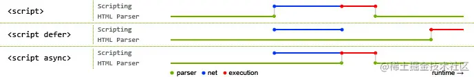

# src和href的区别

---

src和href都是用来引用外部的资源

+ src：指向的内容会嵌入到当前标签所在的位置。当浏览器解析到该元素时，会暂停其他资源的下载和处理，直到将该资源加载、编译、执行完毕。所以一般js脚本会放在页面底部
+ href：超文本引用。指向一些网络资源，建立和当前元素或本文档的链接关系。当浏览器识别到它指向的文件时，会并行下载资源，不会停止对当前文档的处理。常用在a、link标签上

# script标签中defer和async的区别

---

如果没有defer或async属性，浏览器会立即加载并执行相应的脚本。它不会等待后续加载的文档元素，读取到就会开始加载和执行，这样就阻塞了后续文档的加载

这张图可以直观看出三者的区别

蓝色代表js脚本网络加载时间，红色代表js脚本执行时间，绿色代表html解析

**defer和async属性都是去异步加载外部的js脚本文件，它们不会阻塞页面的解析，**区别如下：
+ 执行顺序：多个带async属性的标签，不能保证加载的顺序；多个带defer属性的标签，按顺序加载执行
+ 脚本是否并行执行：async属性，表示后续文档的加载与js脚本的加载是并行进行的，即异步执行，js脚本在加载完就会执行；defer属性，加载后续文档的过程与js脚本的加载（此时仅加载不执行）是并行进行的（异步），js脚本的执行需要等到文档所有元素解析完成之后才进行

# html语义化

---

语义化是指根据内容的结构化（内容语义化），选择合适的标签（代码语义化）。通俗来讲就是用正确的标签做正确的事。

语义化的优点：

+ 对机器友好，带有语义的文字表现力丰富，更适合搜索引擎的爬虫爬取有效信息，有利于SEO。除此之外，语义类还支持读屏软件，根据文章可以自动生成目录。
+ 对开发者友好，使用语义类标签增强了可读性，结构更加清晰，开发者能清晰地看出网页的结构，便于团队的开发与维护。

常见的语义化标签：

```html
<header></header>	头部
<nav></nav>	导航栏
<section></section>	区块（有语义化的div）
<main></main>	主要区域
<article></article>	主要内容
<aside></aside>	侧边栏
<footer></footer> 底部
```

# iframe的优点和缺点

---

iframe称之为嵌入式框架，可以把完整的网页内容嵌入到现有的网页中

优点：
+ 用来加载速度较慢的内容（如广告）
+ 可以使脚本可以并行下载
+ 可以实现跨子域通信

缺点：
+ iframe会阻塞主页面的onload事件
+ 无法被一些搜索引擎所识别
+ 会产生很多页面，不容易管理

# BOM和DOM分别是什么

---

BOM是浏览器对象模型：用来获取或设置浏览器的属性、行为。例如：新建窗口、获取屏幕分辨率、浏览器版本号等

DOM是文档对象模型：用来获取或设置文档中标签的属性。例如获取或设置input表单的value值

# 常见的meta标签

---

`meta`标签由`name`和`content`属性定义，用来描述网页文档的属性，比如网页的作者，网页描述，关键词等

常用的meta标签：

+ `charset`：用来描述HTML文档的编码类型

  ```html
  <meta charset="UTF-8" />
  ```

+ `keywords`：页面关键词

  ```html
  <meta name="keywords" content="关键词" />
  ```

+ `description`：页面描述

  ```html
  <meta name="description" content="页面描述内容" />
  ```

+ `refresh`：页面重定向和刷新

  ```html
  <meta http-equiv="refresh" content="0;url=" />
  ```

+ `viewport`：适配移动端，可以控制视口的大小和比例

  ```html
  <meta name="viewport" content="width=device-width, initial-scale=1, maximum-scale=1" />
  ```

  其中，`content`参数有以下几种

  + `width viewport`：宽度（数值/device-width）
  + `height viewport`：高度（数值/device-height）
  + `initial-scale`：初识缩放比例
  + `maximum-scale`：最大缩放比例
  + `minimum-scale`：最小缩放比例
  + `user-scalable`：是否允许用户缩放（yes/no）

+ 搜索引擎索引方式

  ```html
  <meta name="robots" content="index,follow" />
  ```

  其中，`content`参数有以下几种

  + `all`：文件将被检索，且页面上的链接可以被查询
  + `none`：文件将不被检索，且页面上的链接不可以被查询
  + `index`：文件将被检索
  + `follow`：页面上的链接可以被查询
  + `noindex`：文件将不被检索
  + `nofollow`：页面上的链接不可以被查询

# HTML5有哪些更新

---

1. 语义化标签

   + header：定义文档的页眉（头部）
   + nav：定义导航链接的部分
   + footer：定义文档或节的页脚（底部）
   + article：定义文章内容
   + section：定义文档中的节（section、区段）
   + aside：定义其所处内容之外的内容（侧边）

2. 媒体标签

   + audio（音频）

     ```html
     <audio src='' controls autoplay loop='true'></audio>
     controls 控制面板
     autoplay 自动播放
     loop="true" 循环播放
     ```

   + video（视频）

     ```html
     <video src='' poster='imgs/aa.ipg' controls></video>
     poster 指定视频还没有完全下载完毕，或者用户还没有点击播放前显示的封面。默认显示当前视频文件的第一帧画面
     controls 控制面板
     width
     height
     ```

   + source 因为浏览器对视频格式支持程度不一样，为了能够兼容不同的浏览器，可以通过source来指定视频源

     ```html
     <video>
         <source src='aa.flv' type='video/flv'></source>
     	<source src='aa.mp4' type='video/mp4'></source>
     </video>
     ```

3. 表单

   + 表单类型：
     + email：能够验证当前输入的邮箱地址是否合法
     + url：验证url
     + number：只能输入数字，其他输入不了，而且自带上下增大减小箭头，max属性可以设置为最大值，min属性可以设置为最小值，value为默认值
     + search：输入框后面会提供一个小×，可以删除输入的内容，更加人性化
     + range：可以提供给一个范围，其中可以设置max和min以及value，其中value属性可以设置为默认值
     + color：提供了一个颜色拾取器
     + time：时分秒
     + date：日期选择年月日
     + datetime：时间和日期
     + datetime-local：日期时间控件
     + week：周控件
     + month：月控件
   + 表单属性：
     + placeholder：提示信息
     + autofocus：自动获取焦点
     + autocomplete="on"/autocomplete="off"使用这两个属性有两个前提：
       + 表单必须提交过
       + 必须有name属性
     + required：要求输入框不能为空，必须有值才能够提交
     + pattern="" 写入想要的正则表达式，比如手机号pattern="^(+86)?\d{10}$"
     + multiple：可以选择多个文件或多个邮箱
     + form="form表单的ID"
   + 表单事件：
     + oninput：每当input里的输入框内容发生变化都会触发此事件
     + oninvalid：当验证不通过时触发此事件

4. DOM查询操作

   + document.querySelector()
   + document.querySelectorAll()

   选择的对象可以是标签，可以是类（.），可以是ID（#）

5. Web存储

   HTML5提供了两种在客户端存储数据的新方法：

   + localStorage
   + sessionStorage

6. 其他

   + 拖放：抓取对象以后拖到另一个位置

     ```html
     设置元素可拖放：
     
     ```

   + 画布（canvas）：canvas元素使用JavaScript在网页上绘制图像。画布是一个矩形区域，可以控制其每一像素。canvas拥有多种绘制路径、矩形、图形、字符以及添加图像的方法

     ```html
     <canvas id="myCanvas" width="200" height="100"></canvas>
     ```

   + SVG：SVG指可伸缩矢量图形，用于定义用于网络的基于矢量的图形，使用XML格式定义图形，图像在放大或改变尺寸的情况下其图形质量不会有损失

   + 地理定位：Geolocation 用于定位用户的位置

**总结：**1.新增语义化标签：nav、header、footer、aside、section、article 2.音频、视频标签：audio、video 3.数据存储：localStorage、sessionStorage 4.canvas（画布）、Geolocation（地理定位）、websocket（通信协议） 5.input标签新增属性：placeholder、autocomplete、autofocus、required 6.history API：go、forward、back、pushstate

# 行内元素、块级元素、空(void)元素分别有哪些？

---

+ 行内元素：`a` `b` `span` `img` `input` `select` `strong`
+ 块级元素：`div` `ul` `ol` `li` `dl` `dt` `dd` `h1` `h2` `h3` `h4` `h5` `h6` `p`
+ 空元素，即没有内容的HTML元素。空元素是在开始标签中关闭的，也就是空元素没有闭合标签
  + 常见的有：`<br>` `<hr>` `` `<input>` `<link>` `<meta>`
  + 鲜见的有：`<area>` `<base>` `<col>` `<colgroup>` `<command>` `<embed>` `<keygen>` `<param>` `<source>` `<track>` `<wbr>`

# CSS选择器优先级

---

```
!important > 行内样式 > ID选择器 > 类选择器 > 标签 > 通配符 > 继承 > 浏览器默认属性
```

# 盒模型

---

CSS3中的盒模型有两种：标准盒子模型、IE盒子模型

盒模型都是由四个部分组成的，分别是margin、border、padding和content

标准盒模型和IE盒模型的区别在于设置width和height时，所对应的范围不同

> 标准盒模型的width和height属性的范围只包含了content
>
> IE盒模型的width和height属性的范围包含了border、padding和content

可以通过修改元素的`box-sizing`属性来改变元素的盒模型：

> `box-sizing:content-box`表示标准盒模型（默认值）
>
> `box-sizing:border-box`表示IE盒模型（怪异盒模型）

# CSS中的不可被继承属性

---

display：规定元素应该生成的框的类型

文本属性：

- vertical-align：垂直文本对齐
- text-decoration：规定添加到文本的装饰
- text-shadow：文本阴影效果
- white-space：空白符的处理
- unicode-bidi：设置文本的方向

盒子模型的属性：width、height、margin、border、padding

背景属性：background、background-color、background-image、background-repeat、background-position、background-attachment

定位属性：float、clear、position、top、right、bottom、left、min-width、min-height、max-width、max-height、overflow、clip、z-index

生成内容属性：content、counter-reset、counter-increment

轮廓样式属性：outline-style、outline-width、outline-color、outline

页面样式属性：size、page-break-before、page-break-after

声音样式属性：pause-before、pause-after、pause、cue-before、cue-after、cue、play-during

# 水平垂直居中的实现

---

+ 利用绝对定位，先将元素的左上角通过top:50%和left:50%定位到页面的中心，然后在通过translate来调整元素的中心点到页面的中心。该方法需要考虑浏览器兼容问题

  ```css
  .parent{
      position: relative;
  }
  .child{
      position: absolute;
      left: 50%;
      top: 50%;
      transform: translate(-50%,-50%);
  }
  ```

+ 利用绝对定位，设置四个方向的值都为0，并将margin设置为auto，由于宽高固定，因此对应方向实现平分，可以实现水平和垂直方向上的居中。该方法适用于盒子有宽高的情况

  ```css
  .parent{
      position: relative;
  }
  .child{
      position: absolute;
      top: 0;
      bottom: 0;
      left: 0;
      right: 0;
      margin: auto;
  }
  ```

+ 利用绝对定位，先将元素的左上角通过top:50%和left:50%定位到页面的中心，然后再通过margin负值来调整元素的中心点到页面的中心。此方法适用于盒子宽高已知的情况

  ```css
  .parent{
      position: relative;
  }
  .child {
      position: absolute;
      top: 50%;
      left: 50%;
      margin-top: -50px;	/* 自身height的一半 */
      margin-left: -50px;	/* 自身width的一半 */
  }
  ```

+ 使用flex布局，通过align-items:center和justify-content:center设置容器的垂直和水平方向上为居中对齐，然后它的子元素也可以实现垂直和水平的居中。该方法要考虑兼容的问题，在移动端用的较多

  ```css
  .parent {
      display: flex;
      justify-content: center;
      align-items: center;
  }
  ```

# BFC

---

BFC(Block Formation Context)块级格式化上下文

+ BFC是一个CSS中的一个隐含的属性，可以为一个元素开启BFC
+ 开启BFC该元素会变成一个独立的布局区域，让处于BFC内部的元素与外部的元素相互隔离

元素开启BFC后的特点：

+ 开启BFC的元素不会被浮动元素所覆盖
+ 开启BFC的元素子元素和父元素外边距不会重叠
+ 开启BFC的元素可以包含浮动的子元素

开启BFC的方式：

+ position:fixed/absolute
+ float不为none
+ overflow不为visible（常用）
+ display的值为inline-block、table-cell、table-caption

# display

---

| 属性值       | 作用                                                     |
| ------------ | -------------------------------------------------------- |
| none         | 元素不显示，并会从文档流中移除                           |
| block        | 块级元素类型，默认宽度为父元素宽度，可设置宽高，换行显示 |
| inline       | 行内元素类型。默认宽度为内容宽度，不可设置宽高，同行显示 |
| inline-block | 默认宽度为内容宽度，可以设置宽高，同行显示               |
| list-item    | 像块类型元素一样显示，并添加样式列表标记                 |
| table        | 此元素会作为块级表格来显示                               |
| inherit      | 从父元素继承display属性的值                              |

# display的block、inline和inline-block的区别

---

+ `block`：会独占一行，多个元素会另起一行，可以设置width、height、margin和padding属性
+ `inline`：元素不会独占一行，设置width、height属性无效。但可以设置水平方向的margin和padding属性，能设置垂直方向的padding，不能设置垂直方向的margin
+ `inline-block`：将对象设置为inline对象，但对象的内容作为block对象呈现，之后的内联对象会被排列在同一行内

# 隐藏元素的方法

---

+ `display:none`：渲染树不会包含该渲染对象，因此该元素不会在页面中占据位置，也不会响应绑定的监听事件
+ `visibility:hidden`：元素在页面中仍占据空间，但是不会影响绑定的监听事件
+ `opacity:0`：将元素的透明度设置为0，以此来实现元素的隐藏。元素在页面中仍然占据空间，并且能够响应元素绑定的监听事件
+ `position:absolute`：通过使用绝对定位将元素移除可视区域，以此来实现元素的隐藏
+ `z-index:负值`：用其他元素遮盖住该元素，以此来实现隐藏
+ `clip/clip-path`：使用元素裁剪的方法来实现元素的隐藏，这种方法下，元素仍在页面中占据位置，但是不会响应绑定的监听事件
+ `transform:scale(0,0)`：将元素缩放为0，来实现元素的隐藏。这种方法下，元素仍在页面中占据位置，但是不会响应绑定的监听事件

# display:none和visibility:hidden的区别

---

这两个属性都可以让元素隐藏，不可见

+ 在渲染树中
  + `display:none`会让元素完全从渲染树中消失，渲染时不会占据任何空间
  + `visibility:hidden`不会让元素从渲染树中消失，渲染的元素还会占据相应的空间，只是内容不可见
+ 是否可继承
  + `display:none`是非继承属性，子孙节点会随着父节点从渲染树消失，通过修改子孙节点的属性也无法显示
  + `visibility:hidden`是继承属性，子孙节点消失是由于继承了`hidden`，通过设置`visibility:visible`可以让子孙节点显示
+ 修改常规文档流中元素的`display`通常会造成文档的重排，但是修改`visibility`属性只会造成本元素的重绘

# CSS3的新特性

---

+ 新增各种CSS选择器（`:not(.input)`：所有class不是"input"的节点）
+ 圆角(border-radius)
+ 多列布局
+ 阴影和反射(shadow)
+ 文字特效
+ 文字渲染
+ 线性渐变(gradient)
+ 旋转(transform)
+ 增加了旋转、缩放、定位、倾斜、动画、多背景

# 两栏布局的实现

---

一般两栏布局指的是 左边一栏宽度固定，右边一栏宽度自适应

+ 利用浮动，设置左边元素的宽度，并设置向左浮动；将右边元素的margin-left设置为左边元素的宽度，宽度设置为auto（默认为auto，撑满整个父元素）

  ```css
  .outer {
      height: 100px;
  }
  .left {
      float: left;
      width: 200px;
      background-color: pink;
  }
  .right {
      margin-left: 200px;
      width: auto;
      background-color: purple;
  }
  ```

+ 利用浮动，左侧元素设置固定大小，并向左浮动，右侧元素设置overflow：hidden；这样右边就触发了BFC，BFC的区域不会与浮动元素发生重叠

  ```css
  .left {
  	width: 100px;
      height: 200px;
      background-color: pink;
      float: left;
  }
  .right {
      width: auto;
      height: 200px;
      background-color: purple;
      overflow:hidden;
  }
  ```

+ 利用flex布局，将左边元素设置为固定宽度，将右边的元素设置为flex:1

  ```css 
  .outer {
      display: flex;
      height: 100px;
  }
  .left {
      width: 200px;
      background-color: pink;
  }
  .outer {
      flex: 1;
      background-color: purple;
  }
  ```

+  利用绝对定位，将父级元素设置为相对定位，左边元素设置为absolute定位，宽度设置为固定宽度，将右边元素的margin-left的值设置为左边元素的宽度

  ```css
  .outer {
      position: relative;
      height: 100px;
  }
  .left {
      position: absolute;
      width: 200px;
      height: 100px;
      background-color: pink;
  }
  .right {
      margin-left: 200px;
      background-color: purple;
  }
  ```

+ 利用绝对定位，将父级元素设置为相对定位，左边元素宽度设置为固定宽度，右边元素设置为绝对定位，左边定位为左边元素宽度，其余方向定位为0

  ```css
  .outer {
      position: relative;
      height: 100px;
  }
  .left {
      width: 200px;
      background-color: pink;
  }
  .right {
      position: absolute;
      top: 0;
      right: 0;
      bottom: 0;
      left: 200px;
      background-color: purple;
  }
  ```

# 三栏布局的实现

---

三栏布局一般指的是页面中一共有三栏，左右两栏宽度固定，中间自适应的布局

+ 利用绝对定位，左右两栏设置为绝对定位，中间设置对应方向大小的margin值

  ```css
  .outer {
      position: relative;
      height: 100px;
  }
  .left {
      position: absolute;
      width: 200px;
      height: 100px;
      background-color: pink;
  }
  .center {
      margin-left: 200px;
      margin-right: 200px;
      height: 100px;
      background-color: aqua;
  }
  .right {
      position: absolute;
      top: 0;
      right: 0;
      width: 200px;
      height: 100px;
      background-color: purple;
  }
  ```

+ 利用flex布局，左右两栏设置固定大小，中间一栏设置为flex:1

  ```css
  .outer {
      display: flex;
      height: 100px;
  }
  .left {
      width: 100px;
      background-color: pink;
  }
  .center {
      flex: 1;
      background-color: aqua;
  }
  .right {
      width: 100px;
      background-color: purple;
  }
  ```

+ 利用浮动，左右两栏设置固定大小，并设置对应方向的浮动，中间一栏设置左右两个方向的margin值，这种方式**中间一栏必须放到最后**

  ```css
  .outer {
      height: 100px;
  }
  .left {
      float: left;
      width: 200px;
      height: 100px;
      background-color: pink;
  }
  .center {
      height: 100px;
      margin-left: 200px;
      margin-right: 200px;
      background-color: aqua;
  }
  .right {
      float: right;
      width: 200px;
      height: 100px;
      background-color: purple;
  }
  ```

+ 圣杯布局，利用浮动和负边距来实现。父级元素设置左右的padding，三列均设置向左浮动，中间一列放在最前面，宽度设置为父级元素的宽度，因此后面两列都被挤到了下一行，通过设置margin负值将其移动到上一行，再利用相对定位，定位到两边

  ```css
  .outer {
      height: 100px;
      padding-left: 200px;
      padding-right: 200px;
  }
  .left {
      width: 200px;
      height: 100px;
      background-color: pink;
      float: left;
      margin-left: -100%;
      position: relative;
      left: -200px;
  }
  .center {
      width: 100%;
      height: 100px;
      float: left;
      background-color: aqua;
  }
  .right {
      width: 200px;
      height: 100px;
      background-color: purple;
      float: left;
      margin-left: -200px;
      position: relative;
      left: 200px;
  }
  ```

+ 双飞翼布局，双飞翼布局相对于圣杯布局来说，左右位置的保留是通过中间列的margin值来实现的，而不是通过父元素的padding来实现的，本质上来说，也是通过浮动和外边距负值来实现的

  ```css
  .outer {
      height: 100px;
  }
  .left {
      width: 200px;
      height: 100px;
      background-color: pink;
      float: left;
      margin-left: -100%;
  }
  .wrapper {
      width: 100%;
      height: 100px;
      float: left;
  }
  .center {
      margin-left: 200px;
      margin-right: 200px;
      height: 100px;
      background-color: aqua;
  }
  .right {
      width: 200px;
      height: 100px;
      background-color: purple;
      float: left;
      margin-left: -200px;
  }
  ```

