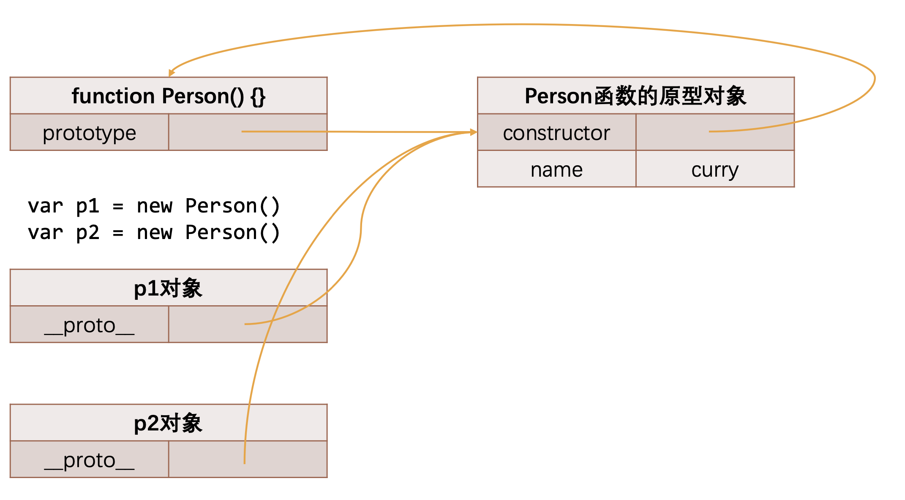
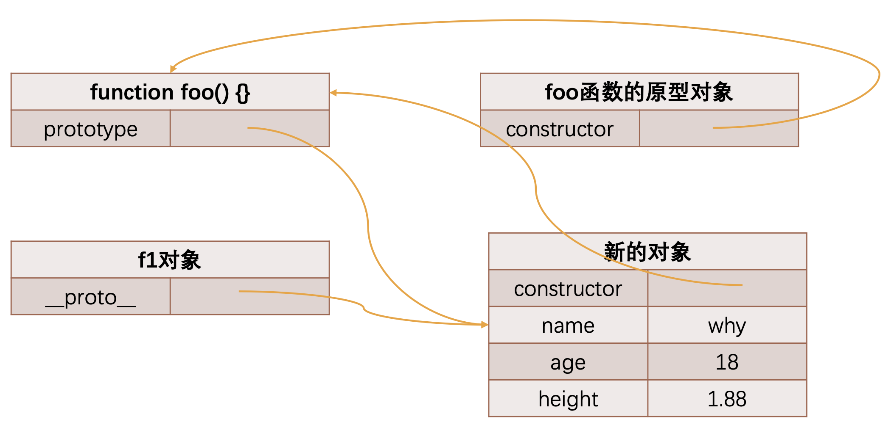

# 原型和原型链

---

原型（`prototype`)和原型链（`prototype chain`）是JavaScript中的核心概念，它们与对象的继承机制密切相关

原型（`prototype`）：在JavaScript中，每个对象都有一个关联的原型。原型本身也是一个对象，包含了一组属性和方法。当我们试图访问一个对象的属性或方法时，如果该对象本身没有这个属性或方法，JavaScript引擎会去对象的原型上查找。原型充当了一种共享资源的角色，使得对象可以继承其原型的属性和方法

原型链（`prototype chain`）：原型链是由一系列原型对象组成的链状结构。当我们访问一个对象的属性或方法时，JavaScript引擎会沿着原型链向上查找，知道找到相应的属性或方法，或者达到原型链的顶端（`null`）。原型链是JavaScript实现继承和属性查找的基础

> 原型链的工作原理如下：
>
> 1. 当试图访问一个对象的属性或方法时，首先在对象自身查找
> 2. 如果对象自身没有找到，那么沿着原型链向上查找，先查找原型对象
> 3. 如果原型对象也没有找到，继续沿着原型链查找，直至达到原型链的顶端（`null`）
> 4. 如果在整个原型链上都没有找到相应的属性或方法，则返回`undefined`

## 对象的原型(`__proto__`)

JavaScript中每个对象都有一个特殊的内置属性`[[prototype]]`，这个属性可以称之为**对象的原型（隐式原型）**，这个特殊的对象可以指向另外一个对象

这个对象有什么用呢？

+ 当我们通过引用对象的属性`key`来获取一个`value`时，它会触发`[[get]]`的操作
+ 这个操作会首先检查该对象是否有对应的属性，如果有的话就使用它
+ 如果对象中没有该属性，那么会访问对象`[[prototype]]`内置属性指向的对象上的属性

> 如果通过字面量直接创建一个对象，这个对象也会有这样的属性吗？如果有，应该如何获取这个属性呢？
>
> + 如果通过字面量直接创建一个对象，也会有这样的属性，只要是对象都会有这样的一个内置属性
> + 获取的方式有两种：
>   + 通过对象的`__proto__`属性可以获取到（但这个是早期浏览器自己添加的，存在一定的兼容性问题）
>   + 通过`Object.getPrototyprOf()`方法可以获取到

## 函数的原型（`prototype`)

所有的函数都有一个`prototype`的属性（不是`__proto__`）

> 对象没有这个属性





## constructor属性

原型对象（`prototype`）上是有一个属性的：`constructor`

+ 默认情况下原型上都会添加一个属性叫做`constructor`，这个`constructor`指向当前的函数对象

  ```js
  function Person() {}
  
  console.log(Person.prototype.constructor);	// [Function: Person]
  ```

+ 如果我们需要在原型上添加过多的属性，通常我们会重写整个原型对象

  ```js
  function Person() {}
  
  Person.prototype = {
    name: 'yasin',
    age: 21,
    eating: function() {}
  }
  ```

  >  前面说过，每创建一个函数，就会同时创建它的prototype对象，这个对象也会自动获取constructor属性，并指向这个函数对象；但是这里相当于给prototype重新赋值了一个对象，那么这个新对象的constructor属性，会指向Object构造函数，而不是Person构造函数了
  >
  > 
  >
  > 我的理解：这里相当于给prototype重新赋值了一个对象，如果我们查找constructor属性，会先在该对象中查找，但是找不到，于是沿着原型链向上查找，在Object的原型对象中找到了constructor属性，而**Object的原型对象中的constructor属性（Object.prototype.constructor）是指向Object构造函数的**，所以如果我们重写整个原型对象时，像`Person.prototype = {}`这样，`Person.prototype.constuctor === Object.prototypr.constuctor`

  > 如果希望constructor仍指向Person，那么可以手动添加
  >
  > ```js
  > Person.prototype = {
  >   constructor: Person,	// 手动添加
  >   name: 'yasin',
  >   age: 21,
  >   eating: function() {}
  > }
  > ```
  >
  > 上面的方法虽然可以，但是也会造成constructor的`[[Enumerable]]`特性被设置了true，而默认情况下，原生的constructor属性是不可枚举的
  >
  > 如果希望解决这个问题，可以使用Object.defineProperty()函数
  >
  > ```js
  > Object.defineProperty(Person.prototype, "constructor", {
  >   enumerable: false,
  >   configurable: true,
  >   writable: true,
  >   value: Person
  > })
  > ```

## 原型链的尽头

---

什么地方是原型链的尽头呢？那个对象是否也是有原型`__proto__`属性呢？

我们会发现它打印的是`[Object: null prototype] {}`

- 事实上这个原型就是最顶层的原型了
- 从`Object`直接创建出来的对象的原型都是`[Object: null prototype] {}`

> `[Object: null prototype] {}`原型有什么特殊吗？
>
> 1. 该对象有原型属性，但是它的原型属性(`__proto__`)已经指向的是`null`，也就是已经是顶层原型了
> 2. 该对象上有很多默认的属性和方法

**`Object`是所有类的父类，原型链最顶层的原型对象就是`Object`的原型对象**

# 继承

---

