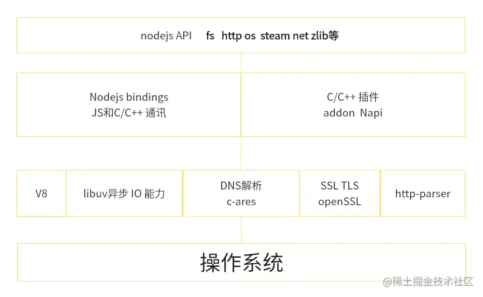

# 概述

---

`Nodejs`不是`JavaScript`应用，也不是编程语言，它是`JavaScript`运行时环境，是开源、跨平台的

`Nodejs`是构建在V8引擎之上的，V8引擎是由C/C++编写的，因此我们的JavaScript代码需要由C/C++转化之后再执行

# 大致架构

---

# npm

---

`npm`（全称 Node Package Manager）是 Node.js 的包管理工具，它是一个基于命令行的工具，用于帮助开发者在自己的项目中安装、升级、移除和管理依赖项

常用命令：

- `npm init`
- `npm install`
- `npm install <package-name>`
- `npm install <package-name> --save`
- `npm install <package-name> --save-dev`
- `npm install -g <package-name>`
- `npm update <package-name>`
- `npm uninstall <package-name>`
- `npm run <script-name>`
- `npm search <keyword>`
- `npm info <package-name>`
- `npm list`：列出当前项目中安装的所有包
- `npm outdated`：列出当前项目中需要更新的包
- `npm publish`
- `npm login`
- `npm logout`
- `npm config list`
- `npm get registery`