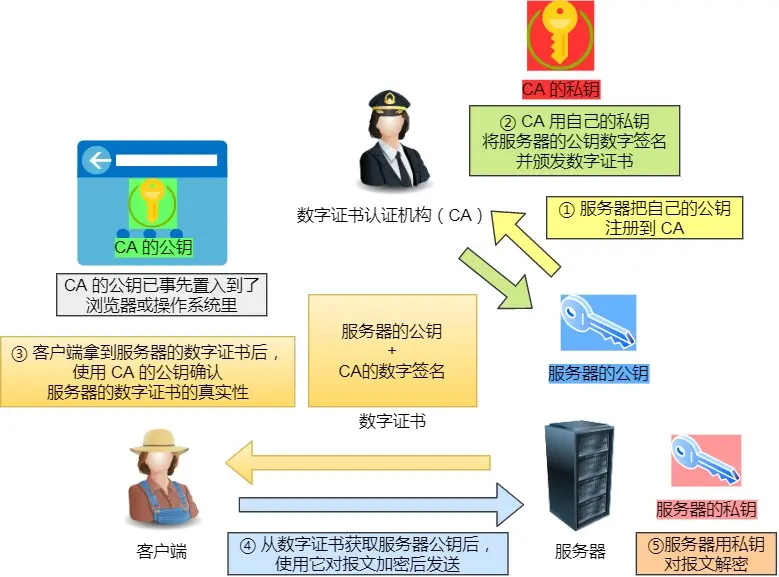

# 网络模型

---

## TCP/IP四层模型

+ 网络接口层

  + 网络接口层包括用于协作ip数据在已有网络介质上传输的协议。它定义像地址解析协议这样的协议，提供TCP/IP协议的数据结构和实际物理硬件之间的接口

  + 可以理解为：确定网络数据包的形式

+ 网络层

  + 网络层对应于OSI七层参考模型的网络层，本层包含IP协议、RIP协议，负责数据的包装、寻址和路由。同时还包含网间控制报文协议用来提供网络诊断信息

  + 可以理解为：该层能确定计算机的位置

+ 传输层

  + 传输层对应于OSI七层参考模型的传输层，它提供两种端到端的通信服务。其中TCP协议提供可靠的数据流运输服务，UDP协议提供不可靠的用户数据报服务

  + TCP：三次握手、四次挥手（面向连接， 可靠）

  + UDP：面向无连接

+ 应用层
  + 应用层对应于OSI七层参考模型的应用层和表达层、会话层

## OSI七层参考模型（Open System Interconnection：开放系统互连）

由低到高有七层：物理层、数据链路层、网络层、传输层、表示层、会话层、应用层

+ 应用层：
  + 专门用于应用程序。与其他计算机进行通讯的一个应用，解决最终通信双方数据传输问题，即不同节点上两个对应应用之间的通信
  + 协议有HTTP、FTP、TFTP、SMTP、SNMP、DNS、TELNET、HTTP、POP3、DHCP等
+ 表示层：
  + 定义数据格式以及加密
  + 在五层模型里面已经合并到了应用层
  + 格式有JPEG、ASCII、DECOIC、加密格式等
+ 会话层：
  + 在会话层及以上的高层次中，数据传送的单位不再另外命名，统称为报文。会话层不参与具体的传输，它提供包括访问验证和会话管理在内的建立和维护应用之间通信的机制。如服务器验证用户登录便是由会话层完成的。定义了如何开始、控制和终止一个会话
  + 在五层模型里面已经合并到了应用层
  + 对应主机进程，指本地主机与远程主机正在进行的会话
+ 传输层：
  + 提供端对端的通信管理。定义传输数据的协议端口号，以及流控和差错检验
  + 协议有：TCP、UDP等，数据包一旦离开网卡即进入网络传输层
+ 网络层：
  + 进行逻辑地址寻址，实现不同网络之间的路径选择
  + （路由选择）协议有：ICMP、IGMP、IP（IPV4、IPV6）、ARP、RARP
  + 在计算机网络中进行通信的两个计算机之间可能会经过很多个数据链路，也可能还要经过很多通信子网。网络层的任务就是选择合适的网间路由和交换结点，确保数据及时传送。网络层将数据链路层提供的帧组成数据包，包中封装有网络层包头，其中含有逻辑地址信息-源站点和目的站点地址的网络地址
+ 数据链路层：
  + 采取差错检测、差错控制、流量控制等方法将有差错的物理线路变为无差错的数据链路
  + 传输介质为“帧”
+ 物理层：
  + 作用是建立、维护、断开物理连接。
  + 物理层实际上就是布线、光纤、网卡和其他用来把两台网络通信设备连接在一起的东西
  + 物理层设置目的就是屏蔽通信设备和通信技术，只需要考虑如何使用物理层服务
  + 传输介质为“比特”

# 浏览器输入url会发生什么

---

> **大致的执行顺序：**URL解析 -> DNS解析：缓存判断+查询IP地址 -> TCP连接：TCP三次握手 -> SSL/TLS四次握手（https才有） -> 浏览器发送请求 -> 浏览器响应请求并返回数据 -> 浏览器解析渲染页面 -> 断开连接：TCP四次挥手

1. **解析url：**首先会对url进行解析，分析所需要使用的传输协议和请求的资源的路径。如果输入的字符不是一个合法的url结构，浏览器会使用搜索引擎对这个字符串进行搜索。如果没有问题，浏览器会检查url中是否出现了非法字符，如果存在非法字符，则会对非法字符进行转义后再进行下一过程。
2. **缓存判断：**浏览器会判断所请求的资源是否在缓存里，如果请求的资源在缓存里，如果请求的资源在缓存里并且没有失效，那么就直接使用，否则向服务器发起新的请求。
3. **dns解析：**下一步首先需要获取的是输入的url中的域名的ip地址，首先会判断本地是否有该域名的ip地址的缓存，如果有则使用，如果没有则向本地dns服务器发起请求。本地dns服务器也会先检查是否存在缓存，如果没有就会先向根域名服务器发起请求，获得负责的顶级域名服务器的地址后，再向顶级域名服务器请求，然后获得负责的权威域名服务器的地址后，再向权威域名服务器发起请求，最终获得域名的ip地址后，本地dns服务器再将这个ip地址返回给请求的用户。用户向本地dns服务器发起请求属于递归请求，本地dns服务器向各级域名发起请求输入迭代请求。
4. **获取mac地址：**当浏览器得到ip地址后，数据传输还需要知道目的主机mac地址，因为应用层下发数据给传输层，tcp协议会指定源端口号和目的端口号，然后下发给网络层。网络层会将本机地址作为源地址，获取的ip地址作为目的地址。然后下发数据给数据链路层，数据链路层的发送需要加入通信双方的mac地址，本机的mac地址作为源mac地址，目的mac地址需要分情况处理。通过将ip地址与本机的子网掩码相与，可以判断是否与请求主机在同一个子网里，如果在同一个子网里，可以使用apr协议获取到目的主机的mac地址，如果不在一个子网里，那么请求应该转发给网关，由它代为转发，此时同样可以通过arp协议来获取网关的mac地址，此时目的主机的mac地址应该为网关的地址。
5. **tcp三次握手：**下面是tcp建立连接的三次握手过程，首先客户端向服务器发送一个syn连接请求报文段和一个随机序号，服务端接受到请求后向服务器端发送一个syn ack报文段，确认连接请求，并且也向客户端发送一个随机序号。客户端接收服务器的确认应答后，进入连接建立的状态，同时向服务器也发送一个ack确认报文段，服务器端接受到确认后，也进入连接建立状态，此时双方的连接就建立起来了。
6. **https握手：**如果使用的是https协议，在通信前还存在tls的一个四次握手的过程。首先由客户端向服务器端发送使用的协议的版本号、一个随机数和可以使用的加密方法。服务器端收到后，确认加密的方法，也向客户端发送一个随机数和自己的数字证书。客户端收到后，首先检查数字证书是否有效，如果有效，则再生成一个随机数，并使用证书中的公钥对随机数加密，然后发送给服务器端，并且还会提供一个前面所有内容的hash值供服务器端校验。服务器端接收后，使用自己的私钥对数据解密，同时向客户端发送一个前面所有内容的hash值供客户端校验。这个时候双方都有了三个随机数，按照之前所约定的加密方法，使用这三个随机数生成一把密钥，以后双方通信前，就是用这个密钥对数据进行加密后再传输。
7. **返回数据：**当页面请求发送到服务器端后，服务器端会返回一个html文件作文响应，浏览器接受到响应后，开始对html文件进行解析，开始页面的渲染过程。
8. **页面渲染：**浏览器首先会根据html文件构建DOM树，根据解析到的css文件构建CSSOM树，如果遇到script标签，则判断是否含有defer或者async属性，要不然script的加载和执行会造成页面的渲染的阻塞。当DOM树和CSSOM树建立好后，根据它们来构建渲染树。渲染树构建好后，会根据渲染树来进行布局。布局完成后，最后使用浏览器的UI接口对页面进行绘制。这个时候整个页面就显示出来了。
9. **tcp四次挥手：**最后一步是tcp断开连接的四次挥手过程。若客户端认为数据发送完成，则它需要向服务器发送连接释放请求。服务端收到连接释放请求后，会告诉应用层要释放tcp连接。然后会发送ack包，并进入CLOSE_WAIT状态，此时表明客户端到服务端的连接已经释放，不再接收客户端发的数据了。但是因为tcp连接时双向的，所以服务端仍旧可以发送数据给客户端。服务端如果此时还有没发完的数据会继续发送，完毕后会向客户端发送连接释放请求，然后服务端便进入LAST-ACK状态。客户端收到释放请求后，想服务端发送确认应答，此时客户端进入TIME-WAIT状态。该状态会持续2MSL（最大段生存期，指报文段在网络中生存的事件，超时会被抛弃）时间，若该时间段内没有服务端的重发请求的话，就进入CLOSED状态。当服务端收到确认应答后，也便进入CLOSED状态。

# TCP和UDP的区别

---

|              | UDP                                        | TCP                                                  |
| ------------ | ------------------------------------------ | ---------------------------------------------------- |
| 是否连接     | 无连接                                     | 面向连接                                             |
| 是否可靠     | 不可靠传输，不使用流量控制和拥塞控制       | 可靠传输（数据顺序和正确性），使用流量控制和拥塞控制 |
| 连接对象个数 | 支持一对一，一对多，多对一和多对多交互通信 | 只能是一对一通信                                     |
| 传输方式     | 面向报文                                   | 面向字节流                                           |
| 首部开销     | 首部开销小，仅8字节                        | 首部最小20字节，最大60字节                           |
| 适用场景     | 适用于实时应用，例如视频会议、直播         | 适用于要求可靠传输的应用，例如文件传输               |

# HTTP与HTTPS

---

## HTTP和HTTPS的区别

+ HTTP是超文本传输协议，信息是明文传输，存在安全风险的问题
+ HTTPS则解决HTTP不安全的缺陷，在TCP和HTTP网络层之间加入了SSL/TLS安全协议，使得报文能够加密传输
+ HTTP连接建立相对简单，TCP三次握手之后便可进行HTTP的报文传输。而HTTPS在TCP三次握手之后，还需进行SSL/TLS的握手过程，才可进入加密报文传输
+ 两者的默认端口不一样，HTTP默认端口号是80，而HTTPS默认端口号是443
+ HTTPS协议需要向CA（证书权威机构）申请数字证书，来保证服务器的身份是可信的

## HTTPS解决了HTTP的哪些问题

+ HTTP由于是明文传输，所以安全上存在以下三个风险：
  + 窃听风险，比如通信链路上可以获取通信内容，用户号容易没
  + 篡改风险，比如强制植入垃圾广告，视觉污染，用户眼容易瞎
  + 冒充风险，比如冒充淘宝网站，用户钱容易没
+ HTTPS在HTTP与TCP层之间加入了SSL/TLS协议，可以很好地解决上述的风险：
  + 信息加密：交互信息无法被窃取
  + 校验机制：无法篡改通信内容，篡改了就不能正常显示
  + 身份证书：证明淘宝是真的淘宝网

> HTTPS是如何解决上面的三个风险的？
>
> + **混合加密**的方式实现信息的**机密性**，解决了窃听的风险
> + **摘要算法**的方式来实现**完整性**，它能够为数据生成独一无二的‘指纹’，指纹用于校验数据的完整性，解决了篡改的风险
> + 将服务器公钥放入到**数字证书**中，解决了冒充的风险

### 混合加密

通过**混合加密**的方式可以保证信息的**机密性**，解决了窃听的风险

HTTPS采用的是**对称加密**和**非对称加密**结合的**混合加密**方式：

+ 在通信建立前采用**非对称加密**的方式交换会话秘钥，后续就不再使用非对称加密
+ 在通信过程中全部使用**对称加密**的会话密钥的方式加密明文数据

采用**混合加密**的方式的原因：

+ **对称加密**只使用一个密钥，运算速度快，密钥必须保密，无法做到安全的密钥交换
+ **非对称加密**使用两个密钥：公钥和私钥，公钥可以任意分发而私钥保密，解决了密钥交换问题但速度慢

### 摘要算法 + 数字签名

为了保证传输的内容不被篡改，我们需要对内容计算出一个**指纹**，然后同内容一起传输给对方

对方收到后，先是对内容也计算出一个**指纹**，然后跟发送方发送的指纹做一个比较，如果**指纹**相同，说明内容没有被篡改，否则就可以判断出内容被篡改了

在计算机里会用**摘要算法（哈希函数）来计算出内容的哈希值**，也就是内容的指纹，这个**哈希值是唯一的，且无法通过哈希值推导出内容**

通过哈希算法可以确保内容不会被篡改，**但是并不能保证*内容+哈希值*不会被中间人替换，因为这里缺少对客户端收到的消息是否来源于服务端的证明**

为了避免这种情况，计算机里会用**非对称加密算法**来解决，共有两个密钥：

+ 一个是公钥，这个是可以公开给所有人的
+ 一个是私钥，这个必须由本人管理，不可泄露

这两个密钥是可以**双向加解密**的，比如可以用公钥加密内容，让后用私钥解密，也可以用私钥加密内容，公钥解密内容

流程的不同，意味着目的也不相同：

+ **公钥加密，私钥解密**，目的是为了**保证内容传输的安全**，因为被公钥加密的内容，其他人是无法解密的，只有持有私钥的人，才能解密出实际的内容
+ **私钥加密，公钥解密**，目的是为了**保证消息不会被冒充**，因为私钥是不可泄露的，如果公钥能正常解密出私钥加密的内容，就能证明这个消息是来源于持有私钥身份的人发送的

因为非对称加密的计算比较耗费性能，一般不会用非对称加密来加密实际的传输内容

所以非对称加密的用途主要在于**通过*私钥加密，公钥解密*的方式，来确认消息的身份**，常说的**数字签名算法**，就是用的这种方式，不过私钥加密内容不是本身，而是**对内容的哈希值加密**

私钥由服务端保管，然后服务端会向客户端颁发对应的公钥。如果客户端收到的信息，能被公钥解密，就说明该消息是由服务器发送的

### 数字证书

# GET和POST有什么区别？

---

GET和POST是HTTP协议中的两种请求方法，它们之间的区别主要体现在以下方面：

+ 「请求参数的位置」：
  + GET请求的请求参数会附加在URL之后，参数之间用`&`连接，多个参数会造成URL长度增加。
  + POST请求的请求参数包含在请求体中，不会在URL中显示
+ 「请求长度的限制」：
  + 由于GET请求的参数附加在URL之后，所以请求长度受限于浏览器对URL长度的限制（通常浏览器对URL的长度有限制，而服务器对URL的长度限制更为宽松）
  + POST请求没有这个问题，POST请求参数包含在请求体中，因此可以传输大量数据
+ 「安全性」：
  + GET请求的参数会暴露在URL中，因此不能用于传输敏感信息，如密码等
  + POST请求的参数在请求体中，不会在URL中显示，相对更加安全
  + POST请求不是一定比GET请求更安全，因为安全性还需要依赖于其他因素，如SSL/TLS加密等
+ 「幂等性」：
  + GET请求是幂等的，即多次执行同一GET请求，服务器将返回相同的结果
  + POST请求则不是幂等的，因为每次提交都会创建新的资源
+ 「缓存」：
  + GET请求可以被缓存
  + POST请求不会被缓存，除非在响应头中包含适当的Cache-Control或Expires字段
+ 「后退/刷新按钮的影响」：
  + GET请求可以被浏览器缓存，因此可以通过点击后退按钮或刷新按钮来重复执行
  + 而POST请求则不会，因为这些操作对POST请求没有实际意义

> 总的来说，GET和POST请求各有其特点和适用场景
>
> GET请求通常用于请求数据
>
> POST请求常用于提交数据
>
> 在选择使用哪种请求方式时，需要考虑到安全性、请求长度、幂等性等因素
