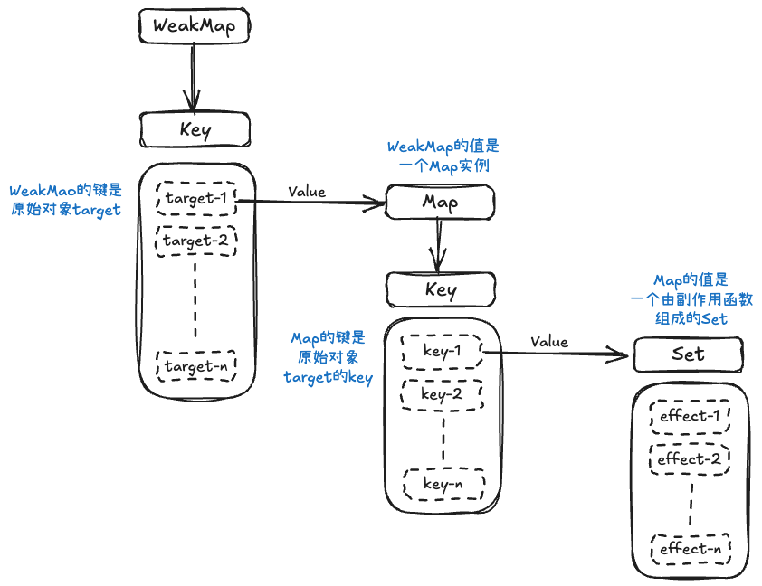

# 响应式系统

---

## 副作用函数

副作用函数是指会产生副作用的函数，如果这个函数的执行会直接或间接地影响其他函数的执行，我们就说这个函数产生了副作用

```js
let val = 1;

function effect() {
	val = 2;	// 修改全局变量，产生了副作用
}
```

## 响应式数据

```js
const obj = { text: 'Hello World!' };

function effect() {
  // effect函数的执行会读取 obj.text
  document.body.innerText = obj.text;
}

obj.text = 'Hello Yasin!';
```

当`obj.text`的值发生变化时，我们希望副作用函数effect能自动重新执行，如果能实现这个目标，那对象obj就是响应式数据

> 如何才能让obj变成响应式数据呢？

## 响应式数据的基本实现

按照上文思路，我们可以将实现响应式数据的操作分成两步：

- 当副作用函数effect执行时，会触发`obj.text`的**读取**操作
- 当修改`obj.text`的值时，会触发`obj.text`的**设置**操作

现在我们再找办法，当`obj.text`进行读取操作时，把副作用函数effect存储起来，当`obj.text`进行设置操作时，再把副作用函数effect取出执行，就可以实现基本的响应式数据了

> 那有什么办法呢？

在ES6之前，我们可以通过`Object.defineProperty`函数来**拦截**一个对象属性的读取和设置操作（Vue2.js采用的方式）；ES6之后，我们可以使用代理对象`Proxy`实现（Vue3.js采用的方式）

> `Proxy` 的出现，是为了给 JavaScript 开发者提供一个**更强大、更底层、更一致**的对象操作拦截机制，从而解决 `Object.defineProperty` 等旧有方法的以下痛点：
>
> 1. **监听不彻底**：无法监听到新增/删除的属性。
> 2. **对数组支持不友好**：无法原生监听数组方法的调用。
> 3. **拦截能力有限**：仅有 `get` 和 `set`，无法拦截函数调用、`in` 操作等。
> 4. **实现复杂且有侵入性**：需要遍历和直接修改原对象，对数组还需特殊处理。
>
> 通过 `Proxy`，现代框架（如 Vue 3, MobX）能够构建出性能更好、功能更强、API 更友好的响应式系统

接下来我们就根据上面的思路，分别使用`Object.defineProperty`和`Proxy`来实现一个基本的响应式数据

`Object.defineProperty`(ES6之前)实现： 

```js
// 存储副作用函数的桶 
var backet = [];

// 原始数据
var data = { text: 'Hello World!' };

function defineReactive(obj, key, val) {
  // 拦截对象属性
  Object.defineProperty(obj, key, {
    // 拦截读取操作
    get() {
      // 存储副作用函数
      bucket.push(effect);
      // 返回属性值
      return val;
    },
    
    // 拦截设置操作
    set(newVal) {
      // 设置属性值
      val = newVal;
      // 取出副作用函数并执行
      bucket.forEach(fn => fn());
      // 返回true表示设置成功
      return true;
    }
  })
}

// 遍历data到每一个属性，转换为响应式
Object.keys(data).forEach(function(key) {
  defineReactive(data, key, data[key]);
})
```

 `Proxy`(ES6+)实现： 

 ```js 
// 存储副作用函数的桶
const bucket = new Set();

// 原始数据
const data = { text: 'Hello World!' };

// 原始数据代理对象
const obj = new Proxy(data, {
  // 拦截读取操作
	get(target, key) {
    // 存储副作用函数
    bucket.add(effect);
    // 返回属性值
    return target[key];
  },
  
  // 拦截设置操作
  set(target, key, newVal) {
    // 设置属性值
    target[key] = newVal;
    // 取出副作用函数并执行
    bucket.forEach(fn => fn());
    // 返回true表示设置成功
    return true;
  }
})
 ```

> 对比两种实现方式：
>
> | 特性             | `Object.defineProperty` 实现                                 | `Proxy` 实现                                                 | 总结                                                         |
> | :--------------- | :----------------------------------------------------------- | :----------------------------------------------------------- | :----------------------------------------------------------- |
> | **监听范围**     | **属性级别**。必须预先遍历对象的所有属性，并为每个属性单独进行拦截。 | **对象级别**。直接监听整个对象，而不是对象的特定属性。       | `Proxy` 更彻底、更全面。                                     |
> | **新增属性**     | **无法监听**。对于在初始化之后新添加的属性，需要手动再次调用 `defineReactive` 进行转换。 | **可以监听**。`Proxy` 天然支持对新增属性的拦截，无需任何额外操作。 | `Proxy` 在处理动态属性时更优越。                             |
> | **删除属性**     | **无法监听**。没有提供 `deleteProperty` 这样的拦截钩子。     | **可以监听**。通过 `deleteProperty` 处理器可以拦截对属性的删除操作。 | `Proxy` 功能更完备。                                         |
> | **数组操作**     | **部分支持，且有缺陷**。能监听到通过索引 (`arr[0] = ...`) 和 `length` 属性的修改，但无法监听到如 `push`, `pop`, `splice` 等数组方法的调用。Vue 2 通过重写这些数组方法来实现监听。 | **完美支持**。`push` 等操作会触发 `set` 陷阱（因为它们会修改 `length` 属性），因此可以被自然地拦截，无需额外处理。 | `Proxy` 对数组的支持更原生、更健壮。                         |
> | **代码简洁性**   | **更复杂**。需要一个递归/遍历函数来初始化所有属性。          | **更简洁**。一次性的 `new Proxy()` 即可完成对整个对象的代理。 | `Proxy` 的实现代码通常更少、更直观。                         |
> | **性能**         | 性能开销主要在**初始化阶段**，需要遍历所有属性。运行时，访问和修改的开销相对较小。 | 性能开销主要在**运行时**，因为每次操作都会通过代理层。但在现代 JavaScript 引擎中，`Proxy` 的性能已经得到了极大的优化，差距通常不明显。 | `Object.defineProperty` 是“一劳永逸”型，`Proxy` 是“次次代理”型。在复杂对象和频繁操作下，`Proxy` 可能表现更优，因为它按需拦截。 |
> | **浏览器兼容性** | **兼容性好**，支持到 IE9（IE8 有部分限制）。这也是 Vue 2 选择它的主要原因之一。 | **兼容性较差**，是 ES6 (ES2015) 的特性，不支持 IE 浏览器。   | `Object.defineProperty` 胜在兼容老旧环境。                   |
> | **实现细节**     | - 使用闭包来存储 `val`。<br>- `bucket` 是一个数组，可能导致副作用函数重复添加。<br>- `set` 后需要返回 `true`。 | - `bucket` 使用 `Set` 数据结构，可以自动去重，更合理。<br>- 直接操作 `target` 对象，语义更清晰。<br>- `set` 后需要返回 `true`。 | `Proxy` 的实现方式在数据结构选择和代码逻辑上可以更优雅。     |

## 设计一个完善的响应系统
刚才，我们了解了如何实现响应式数据，过程中，实现了一个不完善的响应系统，接下来，我们处理一些细节，尝试构造一个完善的响应系统（以下用Proxy实现）
根据之前的思路，我们知道一个响应系统的流程如下：
- **读取**操作发生时，将副作用函数存储到‘桶’中
- **设置**操作发生时，取出副作用函数并执行
如果是刚才的响应系统，我们会发现下面的问题
- 我们**硬编码了副作用函数的名字(effect)**，如果副作用函数的名字不是effect，或者是一个匿名函数，就无法将它存储到‘桶’中
- 我们**没有在副作用函数与被操作的目标字段之间建立明确的联系**。当读取属性时，无论读取的是对象的哪一个属性，都会把副作用函数存储起来；当设置属性时，无论设置哪一个属性，都会将副作用函数取出并执行

首先解决硬编码的问题，我们可以提供一个用来注册副作用函数的机制：
```js
// 用一个全局变量存储被注册的副作用函数
let activeEffect;
// effect函数用于注册副作用函数
function effect(fn) {
	// 将副作用函数fn赋值给activeEffect
	activeEffect = fn;
	// 执行副作用函数
	fn();
}
```
我们可以按照下面的方式使用effect函数：
```js
effect(
	// 匿名副作用函数
	() => {
		document.body.innerText = obj.text;
	}
)
```
当effect函数执行时，首先会把副作用函数fn赋值给activeEffect，接着执行副作用函数，此时会触发obj.text的**读取**操作，触发代理对象Proxy的get拦截函数，这样就可以将activeEffect存储到‘桶’中，无论副作用函数叫什么名字，哪怕是一个匿名函数

接着我们来看副作用函数与被操作字段之间的联系问题
```js
effect(
	() => {
		console.log('effect run');
		document.body.innerText = obj.text;
	}
)

setTimeout(() => {
	obj.notExist = 'hello vue3';
}, 1000);
```
从上述代码中，我们可以看到
我们用effect函数注册了一个匿名的副作用函数，这个副作用函数与obj对象的text属性建立了联系，我们的响应系统想要的效果是`obj.text`进行设置操作时，自动调用副作用函数；但是当我们对obj对象中的notExist属性进行设置操作，没有对text属性进行设置操作时，也调用了副作用函数
所以上述的代码会输出两次`effect run`，一次是副作用函数内部**读取**`obj.text`时输出的，一次是**设置**`obj.notExist`时输出的
> 怎么解决这个问题呢？

我们需要在副作用函数与被操作的字段之间建立联系，这需要我们重新设计‘桶’的结构
我们可以用树型数据结构来表示：
- 被操作（读取）的代理对象target
- 被操作（读取）的字段名text
- 使用effect函数组册的副作用函数effectFn
- ```bash
  target
    └─ key
  		  └─ effectFn
  		  
  // 如果两个副作用函数同时读取同一个对象的属性值：
  target
    └─ text
  		  └─ effectFn1
  		  └─ effectFn2
  		  
  // 如果一个副作用函数中读取了同一个对象的两个不同属性
  target
    └─ text1
  		  └─ effectFn
  	└─ text2
  		  └─ effectFn
  		  
  // 如果在不同的副作用函数中两个不同对象的不同属性
  target1
    └─ text1
  		  └─ effectFn1
  target2
    └─ text2
  		  └─ effectFn2  
  ```

我们可以使用**WeakMap**代替Set作为桶的数据结构，WeakMap由target --> Map 构成，Map由 key --> Set 构成，Set由副作用函数组成



> **`WeakMap`**
>
> `WeakMap`是一种特殊的`Map`。它的**特殊**之处在于它的**键（key）是“弱引用”的，不影响垃圾回收器的工作**，这意味着，如果一个对象只被`WeakMap`作为键引用，而没有其他任何强引用指向它，那么垃圾回收机制就可以在适当的时候**自动回收这个对象，释放内存**。`WeakMap`会自动地、悄无声息地移除这个键值对。
>
> 所以`WeakMap`经常用于存储那些**只有当key所引用的对象存在时才有价值**的信息。如果使用`Map`来代替`WeakMap`，那么即使用户侧的代码对target没有任何引用，这个target也不会被回收，最终可能导致内存溢出


解决了这两个问题，下面我们就可以实现一个完善的响应系统了

```js
// 用一个全局变量存储被注册的副作用函数
let activeEffect;
// 存储副作用函数的桶
const bucket = new WeakMap();

// effect 函数用于注册副作用函数
function effect(fn) {
  // 将副作用函数赋值给activeEffect
  activeEffect = fn;
  // 执行副作用函数
  fn();
}
```

```js
// 修改get/set拦截器代码
const obj = new Proxy(data, {
  // 拦截读取操作
  get(target, key) {
    // 没有activeEffect，直接return
    if (!activeEffect) return target[key];
    // 根据target从‘桶’中取得depsMap（target-->Map)
    let depsMap = bucket.get(target);
    // 如果不存在depsMap，新建一个Map并与target关联
    if (!depsMap) {
      bucket.set(target, (depsMap = new Map()));
    }
    // 再根据key从depsMap中取得deps（key-->Set）
    // 里面存储着所有与当前key相关联的副作用函数
    let deps = depsMap.get(key);
    // 如果deps不存在， 同样新建一个Set并与key关联
    if (!deps) {
      depsMap.set(key, (deps = new Set()));
    }
    // 最后将当前激活的副作用函数存储到‘桶’中
  },
  
  // 拦截设置操作
  set(target, key, newVal) {
    // 设置属性值
    target[key] = newVal;
    // 根据target从桶中取得depsMap
    const depsMap = bucket.get(target);
    if (!depsMap) return;
    // 根据key取得所有副作用函数effects
    const effects = depsMap.get(key)	// Set类型
    // 执行副作用函数
    effects && effect.forEach(fn => fn());
  }
})
```

为了增强代码的健壮性，我们可以进行一些封装处理

```js
const obj = new Proxy(data, {
  get(target, key) {
    track(target, key);
    return target[key];
  },
  
  set(target, key, newVal) {
    target[key] = newVal;
    trigger(target, key);
  }
})

function track(target, key) {
  if (!activeEffect) return target[key];
  let depsMap = bucket.get(target);
  if (!depsMap) {
    bucket.set(target, (depsMap = new Map()));
  }
  let deps = depsMap.get(key);
  if (!deps) {
    depsMap.set(key, (deps = new Set()));
  }
  deps.add(activeEffect);
}

function trigger(target, key) {
  const depsMap = bucket.get(target);
  if (!depsMap) return;
  const effects = depsMap.get(key);
  effects && effects.forEach(fn => fn());
}
```

