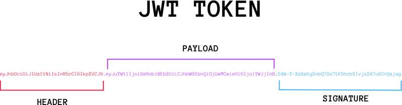

# JWT

---

## 跨域认证的问题

互联网服务离不开用户认证。一般流程是下面这样

> 1. 用户向服务器发送用户名和密码
> 2. 服务器验证通过后，在当前对话（session）里保存相关数据，比如用户角色、登录时间等等
> 3. 服务器向用户返回一个session_id，写入用户的Cookie
> 4. 用户随后的每一次请求，都会通过Cookie，将session_id传回服务器
> 5. 服务器收到session_id，找到前期保存的数据，由此得知用户的身份

这种模式的问题在于，扩展性（scaling）不好。单机当然没有问题，如果是服务器集群，或者是跨域的服务导向架构，就要求 session 数据共享，每台服务器都能够读取 session

举例来说，A 网站和 B 网站是同一家公司的关联服务。现在要求，用户只要在其中一个网站登录，再访问另一个网站就会自动登录，请问怎么实现？

一种解决方案是 session 数据持久化，写入数据库或别的持久层。各种服务收到请求后，都向持久层请求数据。这种方案的优点是架构清晰，缺点是工程量比较大。另外，持久层万一挂了，就会单点失败

另一种方案是服务器索性不保存 session 数据了，所有数据都保存在客户端，每次请求都发回服务器。JWT 就是这种方案的一个代表

## JWT的原理

JWT的原理是，服务器认证之后，生成一个JSON对象，发回给用户

> 类似于
>
> ```json
> {
>   	"姓名": "张三",
>   	"角色": "管理员",
>   	"到期时间": "2025年2月21日0点0分"
> }
> ```

之后，用户与服务端通信的时候，都要发回这个JSON对象。服务器完全只靠这个对象认定用户身份。为了防止用户篡改数据，服务器在生成这个对象的时候，会加上签名

## JWT的数据结构

实际的JWT如下


它是一个很长的字符串，中间用`.`分隔成三个部分。（JWT内部是没有换行的，这里只是为了便于展示）

JWT的三个部分依次如下：

+ Header（头部）
+ Payload（负载）
+ Signature（签名）

写成一行，就是下面的样子

`Header.Payload.Signature`



### Header

Header部分是一个JSON对象，描述JWT的元数据，通常是下面的样子

```json
{
  "alg": "HS256",
  "typ": "JWT"
}
```

上面代码中，`alg`属性表示签名的算法（algorithm），默认是HMAC SHA256（写成HS256）；`typ`属性表示这个令牌（token）的类型（type），JWT令牌统一写成`JWT`

最后，将上面的JSON对象使用Base64URL算法转成字符串

### Payload

Payload部分也是一个JSON对象，用来存放实际需要传递的数据。JWT规定了7个官方字段，供选用

+ iss（issuer）：签发人
+ exp（expiration time）：贵气时间
+ sub（subject）：主题
+ aud（audience）：受众
+ nbf（Not Before）：生效时间
+ iat（Issued At）：签发时间
+ jti（JWT ID）：编号

处了官方字段，还可以在这个部分定义私有字段，如下

```json
{
  "sub": "1234567890",
  "name": "John Doe",
  "admin": true
}
```

需要注意的是，JWT默认是不加密的，任何人都可以读到，所以不要把秘密信息放在这个部分

这个JSON对象也要使用Base64URL算法转成字符串

### Signature

Signature部分是对前两部分的签名，防止数据篡改

首先，需要指定一个密钥（secret）。这个密钥只有服务器才知道，不能泄漏给用户。然后，使用Header里面指定的算法签名（默认是HMAC SHA256），按照下面的公式产生签名

```
HMACSHA256(
  base64UrlEncode(header) + "." +
  base64UrlEncode(payload),
  secret)
```

算出签名以后，把Header、Payload、Signature三个部分拼成一个字符串，每个部分之间用`.`分隔，就可以返回给用户

### Base64URL

前面提到，Header 和 Payload 串型化的算法是 Base64URL。这个算法跟 Base64 算法基本类似，但有一些小的不同

JWT 作为一个令牌（token），有些场合可能会放到 URL（比如 api.example.com/?token=xxx）。Base64 有三个字符`+`、`/`和`=`，在 URL 里面有特殊含义，所以要被替换掉：`=`被省略、`+`替换成`-`，`/`替换成`_` 。这就是 Base64URL 算法

## JWT的使用方式

客户端收到服务器返回的JWT，可以储存在Cookie里面，也可以储存在localStorage

此后，客户端每次与服务器通信，都要带上这个JWT。可以把它放在Cookie里面自动发送，但是这样不能跨域，所以更好的做法是放在HTTP请求的头信息`Authorization`字段里面

```
Authorization: Bearer <token>
```

另一种做法是，跨域的时候，JWT就放在POST请求的数据体里面

## JWT的几个特点

+ JWT默认是不加密的，但也是可以加密的。生成原始Token以后，可以用密钥再加密一次
+ JWT不加密的情况下，不能将秘密数据写入JWT
+ JWT不仅可以用于认证，也可以用于交换信息。有效使用JWT，可以降低服务器查询数据库的次数
+ JWT的最大缺点是，由于服务器不保存session状态，因此无法在使用过程中废止某个token，或者更改token的权限。也就是说，一旦JWT签发了，在到期之前就会始终有效，除非服务器部署额外的逻辑
+ JWT本身包含了认证信息，一旦泄漏，任何人都可以获得该令牌的所有权限。为了减少到用，JWT的有效期应该设置得比较短。对于一些比较重要的权限，使用时应该再次对用户进行认证
+ 为了减少到用，JWT不应该使用HTTP协议明码传输，要使用HTTPS协议传输

# axios封装

---

# vue路由、路由懒加载

---

# websocket

---

# 大语言模型、数据流式传输

---

# Echarts

---

# 防抖节流

---

# 图片懒加载

---

